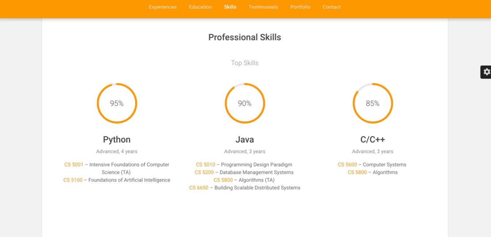

# HomepageDavidChen
David Chen's Homepage ([Demo](http://davidychen.com)) is designed
as my responsive homepage including:
- Experience
- Education
- Skills
- Testimonials
- Portfolio
- Contact

## Preview

### Color Themes

### Gallery


### Pie Chart


## Tech

This webpage uses a number of open source projects to work properly:

* [Font Awesome](https://origin.fontawesome.com/)
* [Bootstrap](https://getbootstrap.com/)
* [SimpleLightbox](http://simplelightbox.com/)
* [jQuery](https://jquery.com/)
* [Popper](https://popper.js.org/)
* [Isotope](https://isotope.metafizzy.co/)

## Installation
```sh
$ git clone https://github.com/davidychen/davidychen.github.io.git
$ cd HomepageDavidChen
$ open index.html
```

## Contributors

- [David Chen](http://davidychen.com)


## License
This project is licensed under the MIT License - see the [LICENSE](LICENSE) file for details


## Acknowledgments
- Inspiration
    - [CS 5610 - Web Development](http://johnguerra.co/classes/webDevelopment_spring_2019/)
